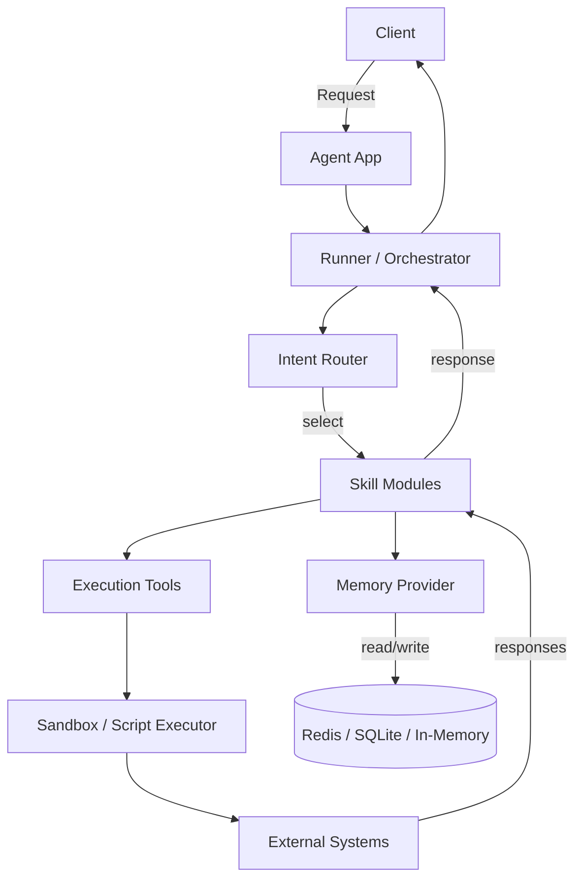

# POC - Agent Chatbot

## Overview

This repository contains a Proof-of-Concept conversational agent platform (Agent Chatbot) designed for integrating modular skills, memory providers, and execution tools to support multi-agent workflows. It demonstrates an extensible architecture for building task-oriented agents, script execution, memory-backed conversations, and connectors for external services.

## Key Features

- Modular skills architecture: each skill is self-contained under `skills/` and implements specific capabilities (answering, code generation, script generation, SAP-related tasks, etc.).
- Pluggable memory providers: in-memory, Redis, SQLite, and OpenAI-based providers available under `tools/memory/providers/`.
- Tooling and execution: action/tool modules for script execution, sandboxing, and custom tools located in `tools/`.
- Agent orchestration: a top-level orchestrator and agent runner to manage conversations and skill routing.
- Tests: basic unit tests for memory components under `tests/`.

## Architecture

The system is divided into the following layers:

- API / Entry Points
  - `app.py` (root) - lightweight entrypoint for running the POC app.
  - `agent/app.py`, `agent/runner.py` - core agent runtime and runner logic.

- Skills
  - `skills/` - each folder contains a `SKILL.md` describing the skill, interfaces, and expected prompts.

- Tools & Execution
  - `tools/` - contains helpers and tool wrappers that the agent can invoke (script execution, sandboxing, memory tools).

- Memory
  - `tools/memory/` - factory and providers for storing conversation state and embeddings.

Flow summary:

1. Client sends a request to the agent entrypoint.
2. The orchestrator/runner selects an appropriate skill based on intent routing.
3. Skills may read/write memory via a provider, call tools, or request script execution.
4. Results are aggregated and returned to the caller.

Mermaid architecture (visual):



## Project Structure

- `app.py` - top-level app entrypoint for quick runs.
- `agent/` - runtime, runner and agent configuration.
  - `agent/app.py`
  - `agent/runner.py`
  - `agent/config/` - runtime configuration
- `skills/` - modular skills (each has `SKILL.md` documentation)
- `tools/` - tool implementations and memory adapters
  - `tools/memory/` - memory factory, interface, providers
  - other tools: `script_execution_tool.py`, `sandbox_tool.py`, etc.
- `tests/` - unit tests for memory and core tooling

## Getting Started

Prerequisites:

- Python 3.10+ (recommended)
- (Optional) Redis if you plan to use the Redis memory provider

Install dependencies:

```bash
pip install -r requirements.txt
```

Run the basic app (POC):

```bash
python app.py
```

Run tests:

```bash
python -m pytest tests
```

## Configuration

Configuration values are defined in `agent/config/config.py`. You can switch memory providers and other runtime settings there. Providers include:

- `in_memory` - fast ephemeral store for testing
- `redis_provider` - requires Redis server
- `sqlite_provider` - file-based local DB
- `openai_provider` - wraps OpenAI for embedding/semantic memory

## How to Add a Skill

1. Create a new folder under `skills/your-skill-name/`.
2. Add a `SKILL.md` explaining the purpose, sample prompts, and inputs/outputs.
3. Implement the skill integration with the runner/orchestrator if the skill needs custom routing.
4. Use existing tools in `tools/` for script execution, memory access, and sandboxing.

## Memory & Data Flow

- Memory is accessed through a uniform `memory` interface.
- Skills request and persist conversational context using the selected provider.
- For long-term memory and vector-based retrieval, embeddings can be stored via the `openai_provider` or other embedding service.

## Development Notes

- Keep skills stateless where possible; persist session state in memory providers.
- Tools should be idempotent and sandboxed when executing user-provided scripts.
- Add unit tests for new memory-related behavior under `tests/`.

## Contributing

- Fork the repository and open a pull request with a clear description of changes.
- Add or update tests for new features or bug fixes.
- Update relevant `SKILL.md` or documentation files for new/changed skills.

## Next Steps & Suggestions

- Add CI (GitHub Actions) to run `pytest` and linting on PRs.
- Add example conversation flows and Postman/HTTP examples.
- Add usage badges and a short demo GIF to the README.

## License

This project uses MIT License. Update as required for your organization.

## Contact

For questions or clarifications, open an issue in this repository.
